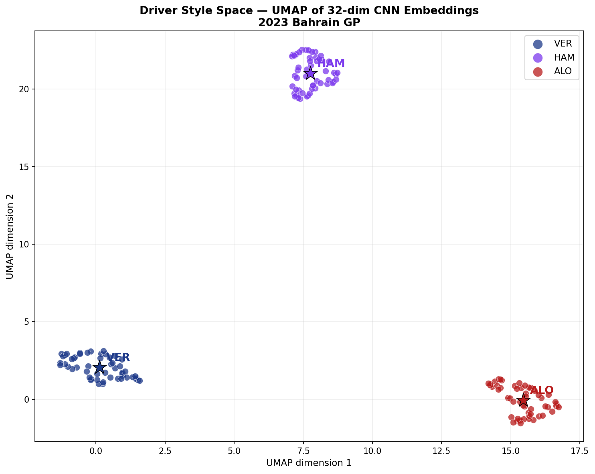
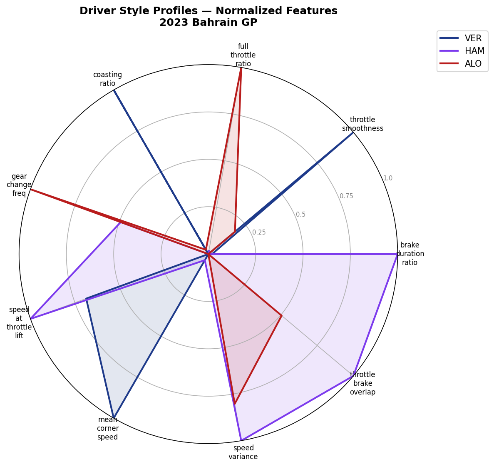
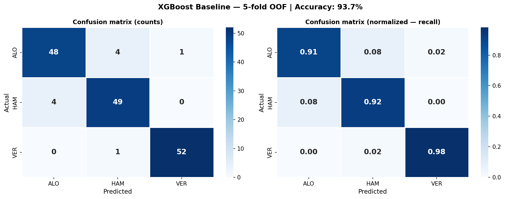
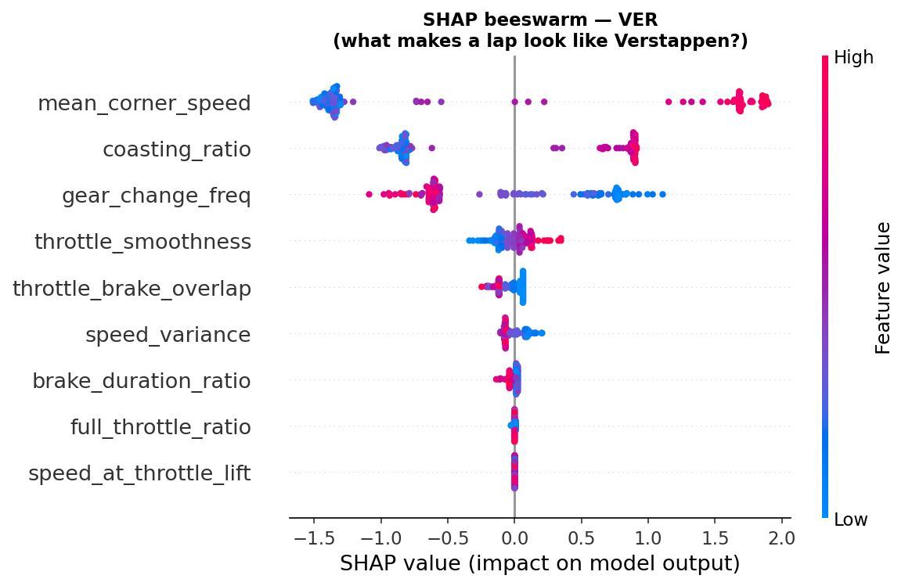

# F1 Driver Style Fingerprinting
### Learning driver identity from raw telemetry using 1D-CNN embeddings and XGBoost

> *Can a machine learn to recognise a Formula 1 driver's identity purely from how they use the throttle, brake, and steering — without knowing anything about the circuit or the car?*


---

## Overview

An end-to-end machine learning pipeline that learns **driver style fingerprints** from Formula 1 telemetry data. Each driver produces a unique signature in how they apply throttle, brake, carry corner speed, and shift gears — patterns that persist across laps and are detectable by both classical and deep learning models.

The project has two modelling stages:

1. **XGBoost baseline** trained on nine hand-crafted per-lap features (braking aggression, throttle smoothness, coasting ratio, etc.) — achieves **93.7% accuracy** on 5-fold out-of-fold evaluation across 6 drivers.
2. **1D-CNN encoder** trained directly on raw telemetry sequences (no feature engineering) — learns a **32-dimensional embedding per lap**, producing silhouette-separated driver clusters (score **0.84**) visualised with UMAP.

The result is a live Streamlit dashboard where you can explore driver style profiles, inspect raw telemetry, and test the model blind — pick a random lap and see if the classifier identifies the driver.

---

## Results

### XGBoost Classifier — 93.7% OOF Accuracy

| Driver | Precision | Recall | F1 |
|--------|-----------|--------|----|
| VER | 0.98 | 0.98 | 0.98 |
| HAM | 0.91 | 0.92 | 0.92 |
| ALO | 0.92 | 0.91 | 0.91 |

Evaluated via 5-fold stratified cross-validation. Random baseline = 33.3%. The 10 misclassified laps are predominantly slow laps (>99s) behind safety cars or pit in/out laps — laps where drivers are not driving at natural pace and therefore lose their stylistic fingerprint.

### CNN Encoder — Silhouette Score 0.84

| Driver | Intra-cluster dist | Inter-cluster dist | Ratio |
|--------|-------------------|-------------------|-------|
| VER | 1.10 | 9.09 | **8.3×** |
| HAM | 1.42 | 7.83 | **5.5×** |
| ALO | 0.90 | 7.87 | **8.7×** |

Ratio > 1 means same-driver laps are closer in embedding space than cross-driver laps. A ratio of 8× means the model learned a tight, compact fingerprint per driver.

### Key Feature Importances (XGBoost)

| Feature | Importance | Interpretation |
|---------|------------|----------------|
| `mean_corner_speed` | 0.271 | How fast the driver carries speed through corners |
| `gear_change_freq` | 0.189 | Mechanical aggression — gear changes per 100 samples |
| `brake_duration_ratio` | 0.174 | Fraction of lap spent braking |
| `coasting_ratio` | 0.117 | Time between throttle lift and brake press |
| `throttle_brake_overlap` | 0.079 | Trail braking — simultaneous throttle + brake |

### Figures

**Driver style space — UMAP of 32-dim CNN embeddings**
Each dot is one lap. The CNN learned these positions from raw sequences alone — no hand-crafted features. Perfectly separated clusters, one per driver.



---

**Driver style profiles — normalised radar chart**
Each axis is one style metric normalised 0→1 across all drivers. The shape of each polygon is that driver's signature.



---

**XGBoost confusion matrix — 5-fold OOF**
Rows = actual driver, columns = predicted. VER is almost perfectly separable (98% recall). Misclassifications are almost entirely ALO↔HAM.



---

**SHAP beeswarm — what makes a lap look like Verstappen?**
Red dots = high feature value. Right of centre = pushes prediction toward VER. High `mean_corner_speed` is the dominant signal, with `coasting_ratio` second.



---

## Architecture

```
Raw F1 Telemetry (FastF1)
        │
        ▼
┌───────────────────┐
│  fetch_telemetry  │  Pull brake/throttle/speed/gear/RPM per lap
│  (src/data/)      │  Cache to parquet. Filter outlier laps.
└────────┬──────────┘
         │
         ▼
┌────────────────────────────────────────────────────────┐
│                    Two parallel paths                   │
└──────────────────┬─────────────────────────────────────┘
                   │
        ┌──────────┴──────────┐
        │                     │
        ▼                     ▼
┌──────────────┐     ┌─────────────────┐
│  Feature     │     │  Raw sequence   │
│  Engineering │     │  (750 samples,  │
│  (9 features)│     │   5 channels)   │
└──────┬───────┘     └────────┬────────┘
       │                      │
       ▼                      ▼
┌──────────────┐     ┌─────────────────┐
│  XGBoost     │     │  1D-CNN Encoder │
│  Classifier  │     │  Conv×3 →       │
│  93.7% OOF   │     │  GlobalAvgPool  │
│  + SHAP      │     │  → 32-dim embed │
└──────────────┘     └────────┬────────┘
                               │
                               ▼
                      ┌─────────────────┐
                      │  UMAP (32→2D)   │
                      │  Silhouette 0.84│
                      └─────────────────┘
                               │
                               ▼
                   ┌───────────────────────┐
                   │  Streamlit Dashboard  │
                   │  Radar · UMAP · Blind │
                   │  ID · Telemetry view  │
                   └───────────────────────┘
```

### CNN Architecture

```
Input: (batch, 5 channels, 750 timesteps)
  → Conv1d(5→32,  k=7) + BatchNorm + ReLU + MaxPool2   # 750 → 375
  → Conv1d(32→64, k=5) + BatchNorm + ReLU + MaxPool2   # 375 → 187
  → Conv1d(64→128,k=3) + BatchNorm + ReLU + AdaptiveAvgPool  # → 128
  → Linear(128→32)   ← embedding extracted here
  → Linear(32→N)     ← classification head (discarded after training)

Total parameters: 40,835
```

---

## Engineered Features

| Feature | Definition | Style signal |
|---------|------------|--------------|
| `brake_duration_ratio` | Fraction of lap with brake pressed | High = heavy braker |
| `throttle_smoothness` | Mean absolute diff between consecutive throttle samples | Low = smooth (Hamilton style) |
| `full_throttle_ratio` | Fraction of lap at ≥98% throttle | High = long flat-out sections |
| `coasting_ratio` | Fraction with brake=0 AND throttle<10% | High = lifts early before corners |
| `gear_change_freq` | Gear shifts per 100 samples | High = aggressive (Alonso style) |
| `speed_at_throttle_lift` | Mean speed at moment of sharp throttle drop | High = braking late |
| `mean_corner_speed` | Mean speed when nGear ≤ 4 | High = carries more speed through corners |
| `speed_variance` | Standard deviation of speed across lap | High = large speed differentials |
| `throttle_brake_overlap` | Fraction with throttle>10% AND brake=1 | High = trail braking (Hamilton) |

---

## Project Structure

```
f1-driver-fingerprinting/
├── data/
│   ├── raw/                    # FastF1 cache (gitignored)
│   ├── processed/              # Per-driver parquet files (gitignored)
│   └── features/               # Engineered CSVs, embeddings, UMAP coords
├── notebooks/
│   ├── 01_data_exploration.ipynb
│   ├── 02_feature_engineering.ipynb
│   ├── 03_baseline_classifier.ipynb
│   └── 04_embedding_visualization.ipynb
├── src/
│   ├── data/
│   │   └── fetch_telemetry.py
│   ├── features/
│   │   └── engineer.py
│   └── models/
│       ├── baseline.py
│       └── cnn_encoder.py
├── app/
│   └── streamlit_app.py
├── outputs/
│   ├── models/                 # Saved .pkl and .pt files (gitignored)
│   └── figures/                # All output plots
├── config.yaml
├── requirements.txt
└── README.md
```

---

## Setup & Reproduction

### 1. Clone and install

```bash
git clone https://github.com/NifraWahaj/f1-driver-fingerprinting
cd f1-driver-fingerprinting
python -m venv venv
source venv/bin/activate        # Windows: venv\Scripts\activate
pip install -r requirements.txt
```

### 2. Configure drivers and race

Edit `config.yaml` to select drivers and race. Default:

```yaml
session:
  year: 2023
  race: "Bahrain"
  session_type: "R"

drivers:
  - "VER"
  - "HAM"
  - "ALO"
  - "LEC"
  - "SAI"
  - "NOR"
```

Any driver abbreviation supported by FastF1 works. Any race from 2018 onwards is available.

### 3. Run the pipeline

Run each script from the project root in order:

```bash
# Step 1 — Pull telemetry (downloads ~200MB, cached after first run)
python src/data/fetch_telemetry.py

# Step 2 — Engineer per-lap features
python src/features/engineer.py

# Step 3 — Train XGBoost baseline + SHAP
python src/models/baseline.py

# Step 4 — Train 1D-CNN encoder + extract embeddings
python src/models/cnn_encoder.py

# Step 5 — Run notebooks for visualisations (optional)
jupyter notebook notebooks/
```

### 4. Launch the dashboard

```bash
streamlit run app/streamlit_app.py
```

---

## Data Source

All telemetry is pulled via **[FastF1](https://github.com/theOehrly/Fast-F1)** — an open-source Python library that provides access to official F1 timing and telemetry data. Data is cached locally after the first download.

Channels used: `Brake`, `Throttle`, `Speed`, `nGear`, `RPM`, `SessionTime`.

No paid API keys required.

---

## Design Decisions & Honest Limitations

**Why two models?** XGBoost on hand-crafted features answers "do interpretable style signals exist?" The CNN answers "can the model learn a fingerprint without being told what to look for?" Both questions are worth answering separately and the two results reinforce each other.

**Train/test split caveat.** Both models are evaluated within a single race (2023 Bahrain GP). This means the model may be learning track-specific patterns in addition to pure driving style. The honest accuracy is conditional on circuit. Cross-track generalisation is the most important open question — see Future Work.

**100% CNN validation accuracy.** The CNN achieved 100% on the held-out validation split (32 laps). This is plausible given the strong feature separation visible in UMAP, but should be interpreted cautiously given the small dataset size. The XGBoost 5-fold OOF accuracy of 93.7% is the more conservative and trustworthy generalisation estimate.

**Car vs driver confound.** Some features (especially `mean_corner_speed`) partially reflect car performance rather than pure driving style. In 2023 the Red Bull RB19 had a significant aerodynamic advantage. A more robust study would control for car by comparing teammates (e.g. VER vs Pérez) or normalising by fastest lap delta.

---

## Future Work

### Cross-track generalisation
The single most important extension. Train on Bahrain, test on Monaco, Monza, and Silverstone — circuits with completely different corner profiles. If the fingerprint holds, it is genuinely driver-specific. If accuracy drops significantly, the model is partially learning track-car interaction patterns rather than pure style.

### Teammate comparison
Comparing drivers in identical cars (VER vs Pérez, LEC vs SAI) would isolate driver style from car performance. This is the cleanest experimental design for answering the core research question and would produce more defensible results.

### Multi-season stability
Do driver fingerprints stay stable across seasons? Alonso in 2023 vs 2021 (different teams, different cars) — does the model still recognise him? This would test whether the fingerprint captures a true long-term driving identity or is confounded by car characteristics.

### Contrastive learning
Replace cross-entropy training with a contrastive objective (SimCLR or Triplet Loss): train the encoder to pull same-driver laps together and push different-driver laps apart directly in embedding space, rather than as a side-effect of classification. This typically produces higher-quality, more generalisable embeddings with small datasets.

### Anomaly detection
Use the per-driver embedding distribution as a baseline. Flag laps that are statistical outliers for that driver — these may correspond to mechanical issues, strategy adjustments under safety car, or tyre failures before they appear in timing data.

### Sector-level fingerprinting
Currently the fingerprint is per-lap. Breaking it down to per-sector or per-corner would enable more granular analysis — a driver's style may be highly distinctive at Bahrain's turn 1 but less so at turn 10. Corner-level embeddings could reveal which parts of a circuit best expose each driver's identity.

### REST API deployment
Package the pipeline as a FastAPI service with a `/fingerprint` endpoint that accepts a driver abbreviation, race name, and lap number and returns the embedding vector plus a similarity ranking against all other drivers in the database.

---

## Tech Stack

| Component | Library |
|-----------|---------|
| Telemetry data | FastF1 3.4 |
| Data processing | pandas, numpy, pyarrow |
| Feature engineering | Custom (src/features/engineer.py) |
| Classical ML | XGBoost 2.0 |
| Interpretability | SHAP |
| Deep learning | PyTorch 2.3 |
| Dimensionality reduction | UMAP-learn |
| Dashboard | Streamlit 1.35 + Plotly |
| Hyperparameter tuning | Optuna |

---

*All F1 data sourced via FastF1 from official F1 timing feeds.*